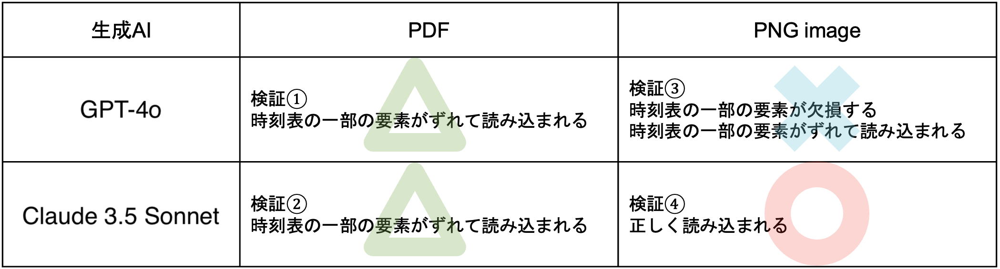
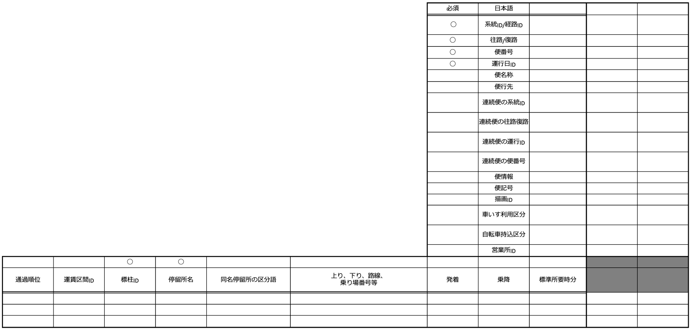

追加検証で時刻表作成の検証をやる必要がある

# 生成AIを使ったGTFS自動作成ツール

## はじめに

本レポートでは、生成AIを活用してGTFS形式のデータを作成するツールの検証を実施した。  
また、時刻表からの情報読み取りからGTFS出力までを範囲とした。

沖縄県島尻郡座間味村において運行している村営バスの時刻表をインプットとして利用した。
この時刻表を用いて、筆者が西沢ツール(後述)を利用して正解データを作成した。

本検証は2024年4月〜2025年2月に実施したもので、生成AIのモデルとしては以下のバージョンを利用した。

* ChatGPT: GPT-4o
* Claude: claude3.5 sonnet

### GTFSとは

GTFS(Ghe General Transit Feed Specification)は、  
公共交通システムに関する情報を利用者に提供するためのオープンスタンダードである。  
これにより、公共交通事業者はさまざまなソフトウェアアプリケーションが利用できる形式で、  
運行データを公開することができる。  
現在、GTFSのデータ形式は多くの公共交通事業者によって使用されている。  
GTFSには、`GTFS Schedule` と `GTFS Realtime` の2つの形式が存在する。  

GitHub google/transit より引用 (https://github.com/google/transit)

### 生成AIとは

ユーザー側の調整やスキルなしに自然な言語で指示を出すだけで、容易に活用できる
テキスト・画像・音声などのマルチモーダルなアウトプットを自律的に生成できるAI技術の総称

総務省 令和6年版 情報通信白書 より抜粋 (https://www.soumu.go.jp/johotsusintokei/whitepaper/ja/r06/html/nd131210.html)

## 仮説

GTFS形式は複数のテキストファイルがリレーションを持っており、構造が複雑なため、データ作成には一定のスキルが必要とされている。
GTFS作成に対して、ユーザーにスキルを求めず、自然言語によるインプットで質の高いアウトプット生成が可能な生成AIを適用することができれば、
効率的かつ容易にGTFS作成に関する業務を実行できるのではないかという仮説を立てた。
本検証を行うツールは、コンテンツプロバイダー(以降、CP)等のGTFSを自社サービスに活用している団体が運用を行い、  
中小規模のバス事業者が活用することを想定している。  
また、入力はバス事業者が作成した一般利用者向けの時刻表を想定している。

## 生成AIによるGTFS作成検証

### 本検証について

本検証の範囲を図1に示す。


図1 検証範囲

まずは最小限の範囲に限定したデータ作成検証を行うこととした。
そのため、本検証においては、`shape`や`fare`に関するファイル作成は実施していない。

### プロセス定義

#### プロセス検討

考案した4つのGTFS作成プロセスを図2に示す。


図2 プロセス検討

それぞれの特徴は以下の通り。

1. PDF/PNG形式からの情報を抽出 + 全GTFSファイルを一括で作成
2. PDF/PNG形式からの情報を抽出 + 各GTFSファイルを分割して作成
3. 全GTFSファイルを一括で作成 (PDF/PNG形式によるインプット)
4. 各GTFSファイルを分割して作成 (PDF/PNG形式によるインプット)

プロセスを細かく分割する場合と一括で生成する場合のそれぞれのメリットを以下に上げる。

* プロセスを細かく分割するメリット
  * アウトプットの質を上げるための問題の切り分けが適切に行える
  * 必要となる情報(PDF/PNG, 各テキストファイル等)のみをインプットできる

* 一括で生成するメリット
  * 1つのプロンプトで実行が可能である

今回の取り組みは検証であり、生成AIを活用してGTFS作成を行う課題点と改善方法を明らかにする必要があると考えた。
そのため、2番のプロセスを採用することとした。

#### 定義したプロセス

前述の検討を踏まえて、図3に示すプロセスを定義した。


図3 定義したプロセス

リレーションが貼られていない`agency`, `feed_info`, `calendar`, `calendar_dates`は並列で生成をしている。
リレーションが貼られている`routes`, `stop_times`, `trips`は前のプロセスで生成した結果をインプットに含めている。

### 情報抽出プロセス

一般利用者へ向けた時刻表をインプットとして、情報を抜き出した。
この際に用いたプロンプトは[情報抽出プロンプト](./prompt/01_get-info.txt)で公開している。
インプットの形式として`PDF`, `PNG`の2つを、生成AIとして`ChatGPT`と`Claude`を試したところ、
アウトプットに差が生まれた。この結果を示した表を図4に示す。


図4 情報抽出の質の変化

上記の結果を踏まえ、情報抽出プロセスは`Claude`へ`PNG`形式のインプットを行うこととした。
情報抽出プロセスにて得られたアウトプットを以下に示す。
※ 一部情報を伏せています。

<details><summary> 情報抽出プロセス アウトプット </summary>

```markdown
# バス運行表

## A発 From A

| 時hour | B行 To B | C行 To C | D行 To D |
|--------|--------------------------|----------------|----------------|
| 9      | 15★                      | 15★            | 05             |
| 10     | 10                       | 30◎            | 20             |
|        | 30◎                      |                |                |
| 11     | 10                       |                | 00             |
| 12     | 20                       | 40★            | 30             |
|        | 40★                      |                |                |
| 13     | 30                       |                | 20             |
| 14     | 05★                      | 05★            | 20             |
| 15     | 10◎                      | 10◎            | 00             |
| 16     | 15★                      | 15★            | 30             |
|        | 40                       |                |                |
| 17     |                          | 25             | 35             |

## A行 To A

| 時hour | B発 B Dep. | C発 C Departure | D発 D Dep |
|--------|---------------------------|----------------------|----------------|
| 9      | 25                        | 20 (via B)  | 10♪            |
| 10     | 15▲                       | 40                   | 25♫            |
|        | 35 (via C)              |                      |                |
| 11     | 15                        |                      | 05♪            |
| 12     | 25▲                       | 45▲ (via B) | 35♫            |
|        | 50                        |                      |                |
| 13     | 35                        |                      | 25♪            |
| 14     | 15▲                       | 10▲ (via B) | 25             |
| 15     | 15 (via C)              | 20                   | 05♫            |
| 16     | 25▲                       | 20 (via B)▲ | 35♪            |
|        | 45                        |                      |                |
| 17     |                           | 30▲                  | 40             |

### 記号の意味
- ★：A→C地区→B→Aに戻ります。A → C → B → A
- ◎：A→B→C地区→Aに戻ります。A → B → C → A
- ▲：Dまで行きます。All the way to D
- ♪：Bまで行けます All the way to B
- ♫：BとCに行けます。Goes to B and C

### 料金
- 大人：¥300 (障害者は¥150)
- 小人：¥150 (障害者は¥70)

### お問い合わせ
XXX役場 XXX課 XXX-XXX-XXXX
```
</details>

### agency(事業者)作成プロセス

情報抽出プロセスにて得られたアウトプットをインプットに含んだプロンプトを作成した。
作成したプロンプトは[agency(事業者)作成プロンプト](./prompt/02_agency.txt)にて公開している。

`GPT-4o`で実行した結果を以下に示す。
※ 一部情報を伏せています。

<details><summary> agency(事業者)作成プロセス アウトプット </summary>

```
agency_id,agency_name,agency_url,agency_timezone,agency_lang,agency_phone,agency_fare_url
1,XXX役場,http://example.com/,Asia/Tokyo,ja,XXX-XXX-XXXX,
```

</details>

正解データと変わりないアウトプットとなった。

### calendar(運行日)作成プロセス

情報抽出プロセスにて得られたアウトプットをインプットに含んだプロンプトを作成した。
作成したプロンプトは[calendar(運行日)作成プロンプト](./prompt/03_calendar.txt)にて公開している。

`GPT-4o`で実行した結果を以下に示す。

<details><summary> calendar(運行日)作成プロセス アウトプット </summary>

```
service_id,monday,tuesday,wednesday,thursday,friday,saturday,sunday,start_date,end_date
2024年6月1日~2024年6月30日ダイヤ,1,1,1,1,1,1,1,20240601,20240630
```

</details>

正解データと変わりないアウトプットとなった。

### feed_info(配信情報)作成プロセス

情報抽出プロセスにて得られたアウトプットをインプットに含んだプロンプトを作成した。
作成したプロンプトは[feed_info(配信情報)作成プロンプト](./prompt/04_feed_info.txt)にて公開している。

`GPT-4o`で実行した結果を以下に示す。
※ 一部情報を伏せています。

<details><summary> feed_info(配信情報)作成プロセス アウトプット </summary>

```
feed_publisher_name,feed_publisher_url,feed_lang,feed_start_date,feed_end_date
XXX役場,https://example.com,ja,20240601,20240630
```

</details>

正解データと変わりないアウトプットとなった。

### routes(路線)作成プロセス

情報抽出プロセス, agancy(事業者)作成プロセスにて得られたアウトプットをインプットに含んだプロンプトを作成した。
作成したプロンプトは[routes(路線)作成プロンプト](./prompt/05_routes.txt)にて公開している。

`GPT-4o`で実行した結果を以下に示す。
※ 一部情報を伏せています。

<details><summary> routes(路線)作成プロセス アウトプット </summary>

```
route_id,agency_id,route_short_name,route_long_name,route_desc,route_type,route_color,route_text_color
1,1,バス,A発～B行,,3,,
2,1,バス,A発～B行（C経由）,,3,,
3,1,バス,A発～B行（Dまで）,,3,,
4,1,バス,A発～C行,,3,,
5,1,バス,A発～D行,,3,,
6,1,バス,B発～A行,,3,,
7,1,バス,B発～A行（C経由）,,3,,
8,1,バス,B発～A行（Dまで）,,3,,
9,1,バス,C発～A行（B経由）,,3,,
10,1,バス,C発～A行,,3,,
11,1,バス,C発～A行（B経由・Dまで）,,3,,
12,1,バス,D発～A行,,3,,
13,1,バス,D発～A行（Bまで）,,3,,
14,1,バス,D発～A行（BとCまで）,,3,,
```

</details>

本アウトプットは正解データと同じにはならなかった。
14件のアウトプットの中で、10件は正解データと一致した。
残りの4件は余剰データであり、正解データには存在しなかった。
また正解データには含まれているが、アウトプットに含まれなかったデータが2件存在した。

### stop_times(停車時刻)作成プロセス

情報抽出プロセスにて得られたアウトプットと既存のstops(停留所)をインプットに含んだプロンプトを作成した。
作成したプロンプトは[stop_times(停車時刻)作成プロンプト](./prompt/06_stop_times.txt)にて公開している。

`GPT-4o`で実行した結果を以下に示す。
※ 上から5件のみ抽出しています。

<details><summary> stop_times(停車時刻)作成プロセス アウトプット </summary>

```
trip_id,arrival_time,departure_time,stop_id,stop_sequence,stop_headsign,pickup_type,drop_off_type
5d41402abc4b2a76b9719d911017c592,09:15:00,09:15:00,S5250,1,,0,0
7d793037a0760186574b0282f2f435e7,10:10:00,10:10:00,S5250,1,,0,0
9d5ed678fe57bcca610140957afab571,10:30:00,10:30:00,S5250,1,,0,0
4b227777d4dd1fc61c6f884f48641d02,11:10:00,11:10:00,S5250,1,,0,0
e4da3b7fbbce2345d7772b0674a318d5,12:20:00,12:20:00,S5250,1,,0,0
・・・
```

</details>

`stop_sequence`が全て`1`となっており、停車順を考慮できていない。
正解データが92件と比較してアウトプットは82件であり、10件の欠損がある。

### trips(便)作成プロセス

各プロセスにて得られたアウトプットと既存のcalendar_dates(特別な運行日)をインプットに含んだプロンプトを作成した。
作成したプロンプトは[trips(便)作成プロンプト](./prompt/07_trips.txt)にて公開している。

`GPT-4o`で実行した結果を以下に示す。
※ 上から5件のみ抽出しています。

<details><summary> trips(便)作成プロセス アウトプット </summary>

```
route_id,service_id,trip_id,direction_id,block_id,shape_id
1,島内バス2024年6月1日~2024年6月30日ダイヤ,1d9c8c47f073b7d0a2e3a3c1531d7a01,,,shapes_1_1
1,島内バス2024年6月1日~2024年6月30日ダイヤ,2d2d2e8b4f6b4a9e0c3d4d2d0e1e2f2e,,,shapes_1_2
1,島内バス2024年6月1日~2024年6月30日ダイヤ,3e5e5f2d7a9d8b8c6d3d2e2f1f4a5c3b,,,shapes_1_3
1,島内バス2024年6月1日~2024年6月30日ダイヤ,4f6f7f8d9e1f0d0b3d2e1f2a3a5b6c4c,,,shapes_1_4
1,島内バス2024年6月1日~2024年6月30日ダイヤ,5a6a7a8d9c1e0f0b4c3d2a2b3a5c7e6d,,,shapes_1_5
・・・
```

</details>

`route_id`が全て`1`となっており、便の違いを認識できていない。
正解データが38件と比較してアウトプットは55件であり、17件の余剰データがある。
同じ便であっても別の便として認識しているため余剰データが発生していると思われる。

### 検証結果

`agency`, `calendar`, `feed_info`のように抽出した情報から抜き出してデータを作成する場合は
正解データと変わりない質のアウトプットとなった。

`route`, `stop_times`, `trips`のように生成AIで思考や推測が必要になる場合は
余剰データや欠損データを含んだアウトプットとなった。
人であっても深く考える必要がある作業については、まだ人の代替となることは難しいと思われる。

余剰データや欠損データが含まれている前提でプロセスを組む必要があることが判明した。
そのため、改善したプロセスを図5に示す。


図5 改善プロセス

各データファイル作成後に人による確認作業を取り入れた。
しかし、`stop_times`, `trips`のようなデータ件数が膨大になるファイルも存在するため、
人による確認作業は現実的ではないと考えられる。

## 生成AIと既存ツールを組み合わせたGTFS作成検証

### 追加の検証について

前検証を踏まえ、全てを生成AIで作成するのではなく、
既存ツールと組み合わせたデータ作成プロセスを考案することとした。

### 既存ツールについて

#### 西沢ツール

GTFS出力を行うマクロが組み込まれたエクセルファイル。
エクセルに運行関連情報を打ち込み、マクロを起動させることでGTFSを自動で出力する。
2017年6月に作成され、随時アップデートが入っている。自由に利用が可能。

標準的なバス情報フォーマット作成ツール(西沢ツール)提供ページ より抜粋 (https://gtfs-gis.jp/gtfs/)

### 改善プロセス定義

新しく考案したプロセスを図6に示す。


図6 既存ツールを組み込んだプロセス

「中間データ作成」においては、一般利用者向けの時刻表から前述の西沢ツールへインプットするための中間データを作成する。
本プロセスには大きく「提供情報・事業者情報プロセス」「運行区分情報プロセス」「時刻表情報プロセス」に分けて中間データを作成する。
この中間データはGTFSそのものに比べると人が確認をしやすい形式となっているため、「生成データチェック・入力」にて確認作業を行う。
その後、ツールへインプットし、GTFS作成を実行する。
ツールでGTFS作成を実行しているため、ファイル間のリレーション等も担保される。
上記のようなアイデアで半自動で質の高いGTFS作成を目指す。

### 提供情報・事業者情報プロセス

このプロセスにおいては以下の図7に示すアウトプットが求められる。


図7 提供情報・事業者情報アウトプット

図7が示すアウトプットを出すためのプロンプトは[提供情報・事業者情報作成プロンプト](./prompt/08_agency.txt)にて公開している。

`GPT-o4`で実行した結果を以下に示す。

<details><summary> 提供情報・事業者情報プロセス アウトプット </summary>

```
項目,値
事業者ID,
事業者名称,XXX役場 XXX課
事業者URL,
電話番号,XXX-XXX-XXXX
```

</details>

事業者IDとURLは時刻表に記載がないため、アウトプットに含まれていない。
想定通りのアウトプットとすることが出来た。

### 運行区分情報プロセス

このプロセスにおいては以下の図8に示すアウトプットが求められる。


図8 運行区分情報アウトプット

図8が示すアウトプットを出すためのプロンプトは[運行区分情報作成プロンプト](./prompt/09_routes.txt)にて公開している。

`GPT-o4`で実行した結果を以下に示す。

<details><summary> 運行区分情報プロセス アウトプット </summary>

```
運行日ID,月曜日,火曜日,水曜日,木曜日,金曜日,土曜日,日曜日,サービス開始日,サービス終了日
1,1,1,1,1,1,1,1,20240601,20240630
```

</details>

運行日IDは時刻表に記載がないため、アウトプットに含まれていない。
想定通りのアウトプットとすることが出来た。

### 時刻表情報プロセス

このプロセスにおいては以下の図9に示すアウトプットが求められる。


図9 時刻表情報アウトプット

図9が示すアウトプットを出すには系統に分ける必要がある。
系統に分けるためのプロンプトは[系統情報作成プロンプト](./prompt/09_routes.txt)にて公開している。

`GPT-o4`で実行した結果を以下に示す。

<details><summary> 系統情報作成 アウトプット </summary>

```
事業者ID,経路略称,経路情報,経路ID,記号
001,A～B,A発～B行,1001,★
002,A～B,A発～B行,1002,◎
003,A～B,A発～B行,1003,
004,A～C,A発～C行,1004,★
005,A～C,A発～C行,1005,◎
006,A～C,A発～C行,1006,
007,A～D,A発～D行,1007,
008,B～A,B発～A行,1008,
009,B～A,B発～A行（C経由）,1009,▲
010,C～A,C発～A行,1010,
011,C～A,C発～A行（B経由）,1011,▲
012,D～A,D発～A行,1012,♪
013,D～A,D発～A行,1013,♫
```
</details>

想定と比較すると1件の余剰データが存在している。
「routes(路線)作成プロセス」と同様に質が高いアウトプットとは言えないが、
人によるチェックを挟むことで質を上げることは可能と思われる。

## 生成AIを使ったGTFSデータ利活用

生成AIを使ったGTFSデータの利活用アイデアの検証を実施する。

### 時刻表の合成

A停留所へは、B停留所からもC停留所からも行けるものとする。
この際にそれぞれの時刻表を確認し、現在時刻からどちらの停留所へ向かうべきか判断を下すのは手間がかかる。
このような状況に対して、生成AIとGTFSを活用し、
A停留所へ向かうそれぞれの時刻表を合成した上で、任意のフォーマットで出力するという検証を実施した。

上記を実現するためには、以下の2点を実現する必要がある。

* 特定の停留所から目的の停留所へ向かう時刻を抜き出すこと
* 抜き出した時刻から任意のフォーマットの時刻表を作成すること

#### 時刻を抜き出す

GTFSから時刻を抜き出すプロンプトは[時刻を抜き出すプロンプト](./prompt/11_use_stop_times.txt)で公開している。

`GPT-o4`で実行した結果を以下に示す。

<details><summary> 時刻を抜き出すプロンプト アウトプット </summary>

```
### Route 315
| 発 | 時 | 分 |
|----|----|
| 10 | 30 |
| 15 | 10 |

### Route 317
| 発 | 時 | 分 |
|----|----|
| 9 | 15 |
| 12 | 40 |
| 14 | 5 |
| 16 | 15 |

### Route 318
| 発 | 時 | 分 |
|----|----|
| 17 | 25 |

```

</details>

想定通りに時刻の抜き出しをすることが出来た。

#### 時刻表の作成

時刻表のフォーマットは大きく分けて2つ存在する。

* 特定の停留所における時刻表 (表1)
* 全ての停留所が記載されている時刻表 (表2)

表1 特定停留所の時刻表

| A停留所 | | |
| :---: | :--- | :--- |
| | 平日 | 休日 |
| 9 | 0 10 20 30 40 50 | 0 20 40 |
| 10 | 0 10 20 30 40 50 | 0 20 40 |
| 11 | 0 10 20 30 40 50 | 0 20 40 |
| 12 | 0 10 20 30 40 50 | 0 20 40 |

表2 全停留所記載の時刻表

| XXX系統 XXX行き | | |
| :--- | :--- | :--- |
| A停留所 | 9:00 | |
| B停留所 | 9:05 | |
| C停留所 | 9:10 | 10:00 |
| D停留所 | 9:15 | 10:05 |
| E停留所 | 9:20 | 10:10 |

それぞれの形式の時刻表を生成するプロンプトを作成した。

##### 特定の停留所における時刻表

特定の停留所における時刻表を生成するプロンプトは[特定停留所 時刻表生成プロンプト](./prompt/12_each_bus_stop_times.txt)にて公開している。

`GPT-o4`で実行した結果を以下の図10に示す。


図10 特定停留所 時刻表

##### 全ての停留所が記載されている時刻表

全ての停留所が記載されている時刻表を生成するプロンプトは[全停留所 時刻表生成プロンプト](./prompt/13_all_bus_stop_times.txt)にて公開している。

`GPT-o4`で実行した結果を以下の図11に示す。


図11 全停留所 時刻表

共に想定していたアウトプットを出すことが出来た。
現状は最低限の情報のみを掲載しているが、プロンプトの工夫で情報は追加していくことが可能。

### 更新差分の可視化

バス事業者によるダイヤ改正があった場合、GTFSデータも更新される。
GTFS形式の複雑さからどの点で変更があったかを見つけることは難しい。
そのため、生成AIを活用して差分を人が見てわかる形式で表示する検証を実施した。
本検証は一般利用者へのダイヤ変更案内の作成にも効果的であると思われる。

差分を出力するプロンプトは[更新差分プロンプト](./prompt/14_diff_stop_times.txt)にて公開している。
用意したテストデータでは減便があった場合を想定し、`系統323`の`16:45`と`16:50`の時刻を削除している。

`GPT-o4`で実行した結果を以下に示す。

<details><summary> 更新差分プロンプト アウトプット </summary>

```
### 323
| 時 | 分 |
|----|----|
| 16 | 45 |
| 16 | 50 |

```

</details>

想定されていた差分を出力することが出来た。
現状は減便であるか増便であるかが判別できないため、プロンプトを修正する必要がある。

## まとめ

### 生成AIによるGTFS作成検証について

`agency`, `calendar`, `feed_info`については、正解データと同等のアウトプットが生成された。
生成AIにおいて思考を必要としなかった。
必要情報の抜き出しとフォーマットに当てはめるという比較的単純な作業であった。
ハルシネーションが発生しづらかったものと思われる。

`routes`, `stop_times`, `trips`については、余剰データや欠損データが見られた。
インプットから情報を抜き出すだけではなく、思考してアウトプットを生成することが求められる。
思考プロセスが挟まることでハルシネーションが発生し、余剰データが生成されたと思われる。
また、生成AIの特徴として長いインプットを与えると一部を無視してアウトプットを生成しようとする。
欠損データは生成AIによって無視されたために発生している可能性がある。

### 生成AIと既存ツールを組み合わせたGTFS作成検証について

本検証の過程において、生成AIと既存ツールを組み合わせたワークフローを考案した。
これは昨今、活発に議論されているエージェントの考え方となっている。
完全自律ではないため、広義のエージェントとして捉えられる。

生成AIの進化は目まぐるしく、
OpenAI社が生成AIで社会に衝撃を与えてから1年半もの短い間にとてつもない発展を遂げている。
将来的にはまずは既存ツールを含んだ広義のエージェントにて成功事例が生まれ、
その後に完全自律型のGTFS作成ツールが出てくるのも5年や10年先の話ではないと思われる。
そのため、生成AIの発展に合わせて適宜、検証を繰り返すことは有意であると考える。

### 生成AIを使ったGTFSデータ利活用について

生成AIを使ったGTFSデータ利活用として、
特定条件のもとに時刻表を作成する検証とGTFSの更新差分可視化を実施した。

本検証においては、今までのようなプロンプトエンジニアリングからは脱却したプロンプト作成を試みた。
昨今の生成AIは1つのインプットに対して1つのアウトプットで返すのではなく、
1つのインプットに対して、内部でアウトプットとインプットを繰り返すことで回答の精度を向上させる仕組みを取り入れている。
その点に着目し、`制約`として条件を付随するのではなく、`手順`をインプットすることとした。
`手順`を与えることで、こちらの想定している思考プロセスを辿った形でアウトプットを出力してくれる。
ここでは制約型プロンプトよりも手順型プロンプトの方が回答精度が高いことが判明した。
手順の粒度や指示の詳細さとして適当なのはどの程度かを検証していく必要がある。
